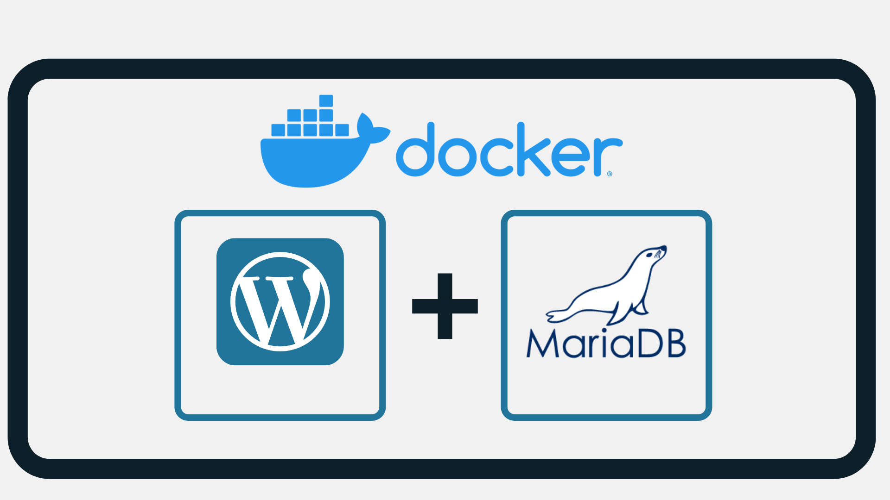

# MariaDB + Wordpress, Dockerized!

---
Author: Ignacio del Corro

Basic template to start a wordpress project using MariaDB as database, with Docker technology.

Under construction, but you can start using it.
You should have the dependencies installed and run the following instuction:
* "cd infrastructure; docker-compose up -d".
***
*You can use the dependencies checker to install the dependencies. For the moment the dependencies are: "docker"; "docker-compose"*
* Run:
  1. chmod u+x installDeps.sh
  2. sudo ./installDeps.sh 

  *sudo is needed because apt-get is used, and this will install only the mentioned dependencies.*
***

To stop the services you can use "docker-compose stop", and to remove the created docker images use "docker-compose rm". If you want to restart use "docker-compose restart". You can see more "docker-compose" options using "docker-compose --help".

---

*Upcoming: A significant upgrade will follow, integrating a more comprehensive configuration into the template and adding an NGINX reverse proxy server.
